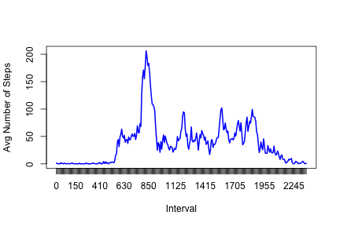
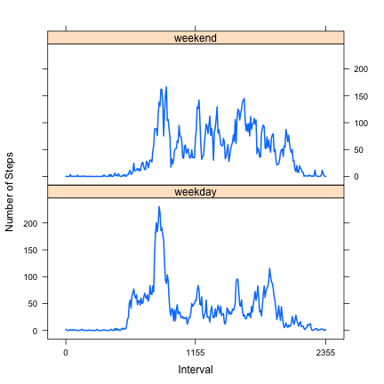

# Reproducible Research: Peer Assessment 1

## Introduction
This assignment is to use RStudio to create an R markdown file for reproducible research. The data used is from a personal activity monitoring device. This device collects data at 5 minute intervals through out the day. The data consist of two months of data from an anonymous individual during the months of October and November, 2012 and include the number of steps taken 5 minute intervals each day.

## Data
The data for this assignment is downloaded from the [GitHub repository create for
this assignment](http://github.com/rdpeng/RepData_PeerAssessment1).
The variables included in this dataset are:
- **steps**: Number of steps taking in a 5-minutes interval (missing values are coded as NA)
- **date**: The date on which the measurement was taken in YYYY-MM-DD format
- **interval**: Identifier for the 5-minute interval in which measurement was taken.
The dataset is stored in a CSV file and there are a total of 17,568 observations in this dataset.
The detailed analysis could be found below.

## Loading and preprocessing the data
We first set the working directory to where the dataset file is located. Then we use a read.csv function to read in the dataset to an R object 'data'. The first few observations of the dataset could be seen below also.


```r
setwd("/Users/xinzhang/Documents/dataScience/reproResearch/RepData_PeerAssessment1")
data <- read.csv("activity.csv")
head(data)
```

```
##   steps       date interval
## 1    NA 2012-10-01        0
## 2    NA 2012-10-01        5
## 3    NA 2012-10-01       10
## 4    NA 2012-10-01       15
## 5    NA 2012-10-01       20
## 6    NA 2012-10-01       25
```

Then to aid our later analysis, the date variable in the dataset is converted to a date variable using as.Date function. The new variable called 'min' which is the number of minutes in the day according to the time interval.

```r
data$date <- as.Date(as.character(data$date))
data$min <- rep(seq(0, by = 5, length = 288), length(levels(factor(data$date))))
head(data)
```

```
##   steps       date interval min
## 1    NA 2012-10-01        0   0
## 2    NA 2012-10-01        5   5
## 3    NA 2012-10-01       10  10
## 4    NA 2012-10-01       15  15
## 5    NA 2012-10-01       20  20
## 6    NA 2012-10-01       25  25
```


## What is mean total number of steps taken per day?
In this part of the analysis, we would like to find the mean and median total number of steps taken per day. To achieve this goal, we first need to calculate the total number of steps taken each day. 

```r
totalStepPerDay <- aggregate(steps ~ date, data = data, FUN = "sum", na.rm = TRUE)
head(totalStepPerDay)
```

```
##         date steps
## 1 2012-10-02   126
## 2 2012-10-03 11352
## 3 2012-10-04 12116
## 4 2012-10-05 13294
## 5 2012-10-06 15420
## 6 2012-10-07 11015
```

A histogram for the total number of steps taken per day is as follows.

```r
hist(totalStepPerDay$steps, main = "Histogram of Total Steps Per Day", xlab = "Total Number of Steps Per Day")
```

 

Then we can calculate the mean and median total number of steps taken per day:

```r
mean(totalStepPerDay$steps)
```

```
## [1] 10766
```

```r
median(totalStepPerDay$steps)
```

```
## [1] 10765
```


## What is the average daily activity pattern?
This part of the analysis focuses on the average daily activity pattern. We first could make a time series plot of the 5-minute interval and the average number of steps taken, averaged across all days.


```r
dailyAvgSteps <- aggregate(steps ~ min, data = data, FUN = "mean", na.rm = TRUE)
with(dailyAvgSteps, plot(min, steps, type = "l", col = "blue", lwd = 2, xlab = "Interval", 
    ylab = "Avg Number of Steps", xaxt = "n"))
axis(side = 1, at = dailyAvgSteps$min, labels = levels(factor(data$interval)))
```

 

The 5-minute interval, on average across all the days in the dataset, that contains the maximum number of steps is

```r
dailyAvgSteps[which.max(dailyAvgSteps$steps), ]
```

```
##     min steps
## 104 515 206.2
```


## Imputing missing values
During this part of the analysis, we will impute the missing values which might bias into some calculations or summaries of the data.

The number of missing values in the dataset could be found using

```r
nrow(data[!complete.cases(data), ])
```

```
## [1] 2304
```

We could fill in the missing values by using the mean of the corresponding 5-minute interval. This could be realized by the following code where a new dataset 'data1' is created. 'data1' contains no missing values

```r
data1 <- data
mergeData <- merge(data[!complete.cases(data), ], dailyAvgSteps, by = "min", 
    all.x = TRUE)
mergeData <- mergeData[order(mergeData$date, mergeData$interval), ]
data1[!complete.cases(data), "steps"] <- mergeData$steps.y
head(data1)
```

```
##     steps       date interval min
## 1 1.71698 2012-10-01        0   0
## 2 0.33962 2012-10-01        5   5
## 3 0.13208 2012-10-01       10  10
## 4 0.15094 2012-10-01       15  15
## 5 0.07547 2012-10-01       20  20
## 6 2.09434 2012-10-01       25  25
```

We could use the reconstructed data to do the analysis in the first step again. The histogram of the total number of steps taken each day is

```r
totalStepPerDay1 <- aggregate(steps ~ date, data = data1, FUN = "sum")
head(totalStepPerDay1)
```

```
##         date steps
## 1 2012-10-01 10766
## 2 2012-10-02   126
## 3 2012-10-03 11352
## 4 2012-10-04 12116
## 5 2012-10-05 13294
## 6 2012-10-06 15420
```

```r
hist(totalStepPerDay1$steps, main = "Histogram of Total Steps Per Day", xlab = "Total Number of Steps Per Day")
```

 

The mean and median total number of steps taken per day are:

```r
mean(totalStepPerDay1$steps)
```

```
## [1] 10766
```

```r
median(totalStepPerDay1$steps)
```

```
## [1] 10766
```

After the missing data imputation, the shape of the distribution is not changed, in the sense that the mean remains the same, but the median changes a little. However, the number of observations increases.

## Are there differences in activity patterns between weekdays and weekends?
For this part of analysis, we will try to investigate if there is difference in activity patterns between weekdays and weekends. We first create a factor variable in the dataset with two levels - "weekday" and "weekend".

```r
weekday <- character(0)
weekday[which(weekdays(data1$date, abbreviate = TRUE) %in% c("Mon", "Tue", "Wed", 
    "Thu", "Fri"))] <- "weekday"
weekday[which(weekdays(data1$date, abbreviate = TRUE) %in% c("Sat", "Sun"))] <- "weekend"
data1$weekday <- weekday
head(data1)
```

```
##     steps       date interval min weekday
## 1 1.71698 2012-10-01        0   0 weekday
## 2 0.33962 2012-10-01        5   5 weekday
## 3 0.13208 2012-10-01       10  10 weekday
## 4 0.15094 2012-10-01       15  15 weekday
## 5 0.07547 2012-10-01       20  20 weekday
## 6 2.09434 2012-10-01       25  25 weekday
```

```r
table(data1$weekday)
```

```
## 
## weekday weekend 
##   12960    4608
```

We next create a panel plot containing a time series plot (i.e. type = "l") of the 5-minute interval (x-axis) and the average number of steps taken, averaged across all weekday days or weekend days (y-axis).

```r
weekdayAvgSteps <- aggregate(steps ~ min + weekday, data = data1, FUN = "mean")
library(lattice)
xyplot(steps ~ min | weekday, data = weekdayAvgSteps, type = "l", lwd = 2, horizontal = FALSE, 
    layout = c(1, 2), ylab = "Number of Steps", xlab = "Interval", scales = list(x = list(at = weekdayAvgSteps$min[c(1, 
        144, 288)], labels = levels(factor(data1$interval))[c(1, 144, 288)])))
```

 


